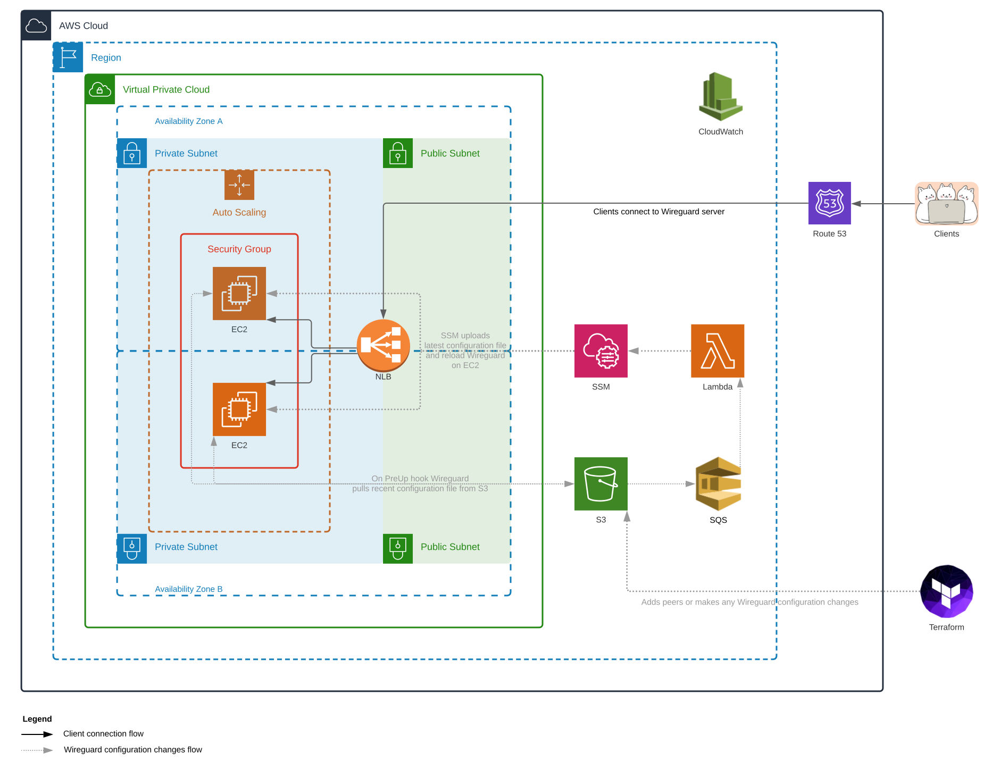

<!-- BEGINNING OF PRE-COMMIT-TERRAFORM DOCS HOOK -->
# tf-wireguard-server
WireGuard® is an extremely simple yet fast and modern VPN that utilizes state-of-the-art cryptography. It aims to be faster, simpler, leaner, and more useful than IPsec, while avoiding the massive headache. It intends to be considerably more performant than OpenVPN.

This repository contains Terraform code to provision Wireguard server in a highly-available, scalable and secure manner, utilizing benefits of AWS infrastructure. The solution is built on top of such services as EC2, NLB, S3, SQS, Lambda, SSM, CloudWatch, SNS and more.

## Design

Above diagram demonstrates highly-available Wireguard setup in a single AWS region. Reference code is located under `examples/multi-az` folder.

### Clients connections
Multiple EC2 instances are spread across several availability zones within a region. Clients connections get distributed to the instances through highly-available Network Load Balancer with Route53 DNS record attached (optional).

### Configuration changes
Wireguard configuration file is being generated by Terraform and stored in S3 bucket with enabled versioning and access logs. Every S3 bucket content change triggers Lambda function through SQS queue. Lambda function executes predefined SSM document on all Wireguard EC2 instances. SSM document is configured to upload the latest configuration file to the instances and reload Wireguard interface.
Also, Wireguard instances have PreUp hook enabled which additionally ensures that they use the latest configuration file available in S3.

## Prerequisites
* Terraform 0.15+
* Terragrunt 0.28.7+ (optional but recommended)
* Configured CLI access to target AWS account

## Quick start
There are multiple examples under `examples` folder. Please, choose the one that fits your needs best. Every example comes with its own `README.md` file.
Example code snippets for simplicity reasons don't define all variables which module exposes. So if you want to get a better understanding of all available options, please review the table below.

## Requirements

| Name | Version |
|------|---------|
|  [terraform](#requirement\_terraform) | >= 0.15.0 |
|  [terraform](#requirement\_terraform) | >= 0.15.0 |
|  [aws](#requirement\_aws) | >= 2.70.0 |
|  [random](#requirement\_random) | ~> 3.1.0 |
|  [wireguard](#requirement\_wireguard) | 0.1.3 |

## Providers

| Name | Version |
|------|---------|
|  [archive](#provider\_archive) | 2.2.0 |
|  [aws](#provider\_aws) | 3.45.0 |
|  [wireguard](#provider\_wireguard) | 0.1.3 |

## Modules

No modules.

## Resources

| Name | Type |
|------|------|
| [aws_autoscaling_attachment.main](https://registry.terraform.io/providers/hashicorp/aws/latest/docs/resources/autoscaling_attachment) | resource |
| [aws_autoscaling_group.main](https://registry.terraform.io/providers/hashicorp/aws/latest/docs/resources/autoscaling_group) | resource |
| [aws_cloudwatch_log_group.main](https://registry.terraform.io/providers/hashicorp/aws/latest/docs/resources/cloudwatch_log_group) | resource |
| [aws_cloudwatch_log_metric_filter.main](https://registry.terraform.io/providers/hashicorp/aws/latest/docs/resources/cloudwatch_log_metric_filter) | resource |
| [aws_cloudwatch_metric_alarm.cpu_high](https://registry.terraform.io/providers/hashicorp/aws/latest/docs/resources/cloudwatch_metric_alarm) | resource |
| [aws_cloudwatch_metric_alarm.disk_used](https://registry.terraform.io/providers/hashicorp/aws/latest/docs/resources/cloudwatch_metric_alarm) | resource |
| [aws_cloudwatch_metric_alarm.lambda_failure](https://registry.terraform.io/providers/hashicorp/aws/latest/docs/resources/cloudwatch_metric_alarm) | resource |
| [aws_cloudwatch_metric_alarm.memory_used](https://registry.terraform.io/providers/hashicorp/aws/latest/docs/resources/cloudwatch_metric_alarm) | resource |
| [aws_cloudwatch_metric_alarm.status_checks](https://registry.terraform.io/providers/hashicorp/aws/latest/docs/resources/cloudwatch_metric_alarm) | resource |
| [aws_iam_instance_profile.main](https://registry.terraform.io/providers/hashicorp/aws/latest/docs/resources/iam_instance_profile) | resource |
| [aws_iam_role.main](https://registry.terraform.io/providers/hashicorp/aws/latest/docs/resources/iam_role) | resource |
| [aws_iam_role.main_lambda](https://registry.terraform.io/providers/hashicorp/aws/latest/docs/resources/iam_role) | resource |
| [aws_iam_role_policy_attachment.main](https://registry.terraform.io/providers/hashicorp/aws/latest/docs/resources/iam_role_policy_attachment) | resource |
| [aws_kms_alias.cloudwatch_logs](https://registry.terraform.io/providers/hashicorp/aws/latest/docs/resources/kms_alias) | resource |
| [aws_kms_alias.main](https://registry.terraform.io/providers/hashicorp/aws/latest/docs/resources/kms_alias) | resource |
| [aws_kms_key.cloudwatch_logs](https://registry.terraform.io/providers/hashicorp/aws/latest/docs/resources/kms_key) | resource |
| [aws_kms_key.main](https://registry.terraform.io/providers/hashicorp/aws/latest/docs/resources/kms_key) | resource |
| [aws_lambda_event_source_mapping.main](https://registry.terraform.io/providers/hashicorp/aws/latest/docs/resources/lambda_event_source_mapping) | resource |
| [aws_lambda_function.main](https://registry.terraform.io/providers/hashicorp/aws/latest/docs/resources/lambda_function) | resource |
| [aws_launch_template.main](https://registry.terraform.io/providers/hashicorp/aws/latest/docs/resources/launch_template) | resource |
| [aws_lb.main](https://registry.terraform.io/providers/hashicorp/aws/latest/docs/resources/lb) | resource |
| [aws_lb_listener.main](https://registry.terraform.io/providers/hashicorp/aws/latest/docs/resources/lb_listener) | resource |
| [aws_lb_target_group.main](https://registry.terraform.io/providers/hashicorp/aws/latest/docs/resources/lb_target_group) | resource |
| [aws_route53_record.main](https://registry.terraform.io/providers/hashicorp/aws/latest/docs/resources/route53_record) | resource |
| [aws_s3_bucket.access_logs](https://registry.terraform.io/providers/hashicorp/aws/latest/docs/resources/s3_bucket) | resource |
| [aws_s3_bucket.main](https://registry.terraform.io/providers/hashicorp/aws/latest/docs/resources/s3_bucket) | resource |
| [aws_s3_bucket.main_logs](https://registry.terraform.io/providers/hashicorp/aws/latest/docs/resources/s3_bucket) | resource |
| [aws_s3_bucket_notification.main](https://registry.terraform.io/providers/hashicorp/aws/latest/docs/resources/s3_bucket_notification) | resource |
| [aws_s3_bucket_object.main](https://registry.terraform.io/providers/hashicorp/aws/latest/docs/resources/s3_bucket_object) | resource |
| [aws_s3_bucket_public_access_block.access_logs](https://registry.terraform.io/providers/hashicorp/aws/latest/docs/resources/s3_bucket_public_access_block) | resource |
| [aws_s3_bucket_public_access_block.main](https://registry.terraform.io/providers/hashicorp/aws/latest/docs/resources/s3_bucket_public_access_block) | resource |
| [aws_s3_bucket_public_access_block.main_logs](https://registry.terraform.io/providers/hashicorp/aws/latest/docs/resources/s3_bucket_public_access_block) | resource |
| [aws_security_group.instance](https://registry.terraform.io/providers/hashicorp/aws/latest/docs/resources/security_group) | resource |
| [aws_security_group_rule.instance-egress-1](https://registry.terraform.io/providers/hashicorp/aws/latest/docs/resources/security_group_rule) | resource |
| [aws_security_group_rule.instance-ingress-1](https://registry.terraform.io/providers/hashicorp/aws/latest/docs/resources/security_group_rule) | resource |
| [aws_security_group_rule.instance-ingress-2](https://registry.terraform.io/providers/hashicorp/aws/latest/docs/resources/security_group_rule) | resource |
| [aws_security_group_rule.instance-ingress-3](https://registry.terraform.io/providers/hashicorp/aws/latest/docs/resources/security_group_rule) | resource |
| [aws_sns_topic.main](https://registry.terraform.io/providers/hashicorp/aws/latest/docs/resources/sns_topic) | resource |
| [aws_sns_topic.main_lambda](https://registry.terraform.io/providers/hashicorp/aws/latest/docs/resources/sns_topic) | resource |
| [aws_sns_topic_subscription.email](https://registry.terraform.io/providers/hashicorp/aws/latest/docs/resources/sns_topic_subscription) | resource |
| [aws_sns_topic_subscription.text](https://registry.terraform.io/providers/hashicorp/aws/latest/docs/resources/sns_topic_subscription) | resource |
| [aws_sqs_queue.main](https://registry.terraform.io/providers/hashicorp/aws/latest/docs/resources/sqs_queue) | resource |
| [aws_sqs_queue.main_dead_letter](https://registry.terraform.io/providers/hashicorp/aws/latest/docs/resources/sqs_queue) | resource |
| [aws_sqs_queue_policy.main](https://registry.terraform.io/providers/hashicorp/aws/latest/docs/resources/sqs_queue_policy) | resource |
| [aws_ssm_document.main](https://registry.terraform.io/providers/hashicorp/aws/latest/docs/resources/ssm_document) | resource |
| [wireguard_asymmetric_key.generated](https://registry.terraform.io/providers/OJFord/wireguard/0.1.3/docs/resources/asymmetric_key) | resource |
| [archive_file.main](https://registry.terraform.io/providers/hashicorp/archive/latest/docs/data-sources/file) | data source |
| [aws_ami.ami](https://registry.terraform.io/providers/hashicorp/aws/latest/docs/data-sources/ami) | data source |
| [aws_caller_identity.current](https://registry.terraform.io/providers/hashicorp/aws/latest/docs/data-sources/caller_identity) | data source |
| [aws_elb_service_account.main](https://registry.terraform.io/providers/hashicorp/aws/latest/docs/data-sources/elb_service_account) | data source |
| [aws_kms_alias.ebs](https://registry.terraform.io/providers/hashicorp/aws/latest/docs/data-sources/kms_alias) | data source |
| [aws_kms_alias.s3](https://registry.terraform.io/providers/hashicorp/aws/latest/docs/data-sources/kms_alias) | data source |
| [aws_region.current](https://registry.terraform.io/providers/hashicorp/aws/latest/docs/data-sources/region) | data source |
| [aws_route53_zone.main](https://registry.terraform.io/providers/hashicorp/aws/latest/docs/data-sources/route53_zone) | data source |
| [aws_subnet.main_private](https://registry.terraform.io/providers/hashicorp/aws/latest/docs/data-sources/subnet) | data source |
| [aws_subnet.main_public](https://registry.terraform.io/providers/hashicorp/aws/latest/docs/data-sources/subnet) | data source |
| [aws_vpc.main](https://registry.terraform.io/providers/hashicorp/aws/latest/docs/data-sources/vpc) | data source |

## Inputs

| Name | Description | Type | Default | Required |
|------|-------------|------|---------|:--------:|
|  [cloudwatch\_alerts\_emails](#input\_cloudwatch\_alerts\_emails) | Email addresses to get monitoring alerts from CloudWatch. Email alert configuration must be manually approved by clicking on the button in confirmation email. Ignored when `cloudwatch_monitoring_enable = false` | `list(string)` | `[]` | no |
|  [cloudwatch\_alerts\_phone\_numbers](#input\_cloudwatch\_alerts\_phone\_numbers) | Phone numbers to get monitoring alerts from CloudWatch. Ignored when `cloudwatch_monitoring_enable = false` | `list(string)` | `[]` | no |
|  [cloudwatch\_log\_retention\_days](#input\_cloudwatch\_log\_retention\_days) | For how long CloudWatch will store log files (days) | `number` | `180` | no |
|  [cloudwatch\_monitoring\_enable](#input\_cloudwatch\_monitoring\_enable) | Enable CloudWatch monitoring of Wireguard resources. Disable if you don't plan to use CloudWatch monitoring solution | `bool` | `true` | no |
|  [dns\_zone\_name](#input\_dns\_zone\_name) | Route53 DNS zone name for Wireguard server endpoint. If not set, AWS LB DNS record is used | `string` | `""` | no |
|  [ec2\_iam\_policy\_names](#input\_ec2\_iam\_policy\_names) | Additional IAM policies to assign to EC2 instances through instance profiles if needed | `list(string)` | `[]` | no |
|  [ec2\_instance\_main\_interface\_name](#input\_ec2\_instance\_main\_interface\_name) | EC2 instance primary network interface name | `string` | `"eth0"` | no |
|  [ec2\_instance\_type](#input\_ec2\_instance\_type) | EC2 instance type | `string` | `"t3.micro"` | no |
|  [enable\_termination\_protection](#input\_enable\_termination\_protection) | Enable termination protection for resources | `bool` | `true` | no |
|  [name\_suffix](#input\_name\_suffix) | Suffix to be added to all resources to uniquely identify this setup | `string` | n/a | yes |
|  [private\_subnet\_cidrs](#input\_private\_subnet\_cidrs) | VPC private subnets CIDR to create EC2 instances in. AZs of public & private subnets must match | `list(string)` | n/a | yes |
|  [prometheus\_exporters\_enable](#input\_prometheus\_exporters\_enable) | Run Prometheus Exporters (Node Exporter & Wireguard Exporter) on EC2 instances. Disable if you don't plan to use Prometheus monitoring solution | `bool` | `true` | no |
|  [public\_subnet\_cidrs](#input\_public\_subnet\_cidrs) | VPC public subnets CIDR to create NLB in. Multiple subnets are used for HA. AZs of public & private subnets must match | `list(string)` | n/a | yes |
|  [s3\_bucket\_name\_prefix](#input\_s3\_bucket\_name\_prefix) | Prefix to be added to S3 bucket name | `string` | n/a | yes |
|  [ssh\_keypair\_name](#input\_ssh\_keypair\_name) | EC2 SSH key pair name | `string` | n/a | yes |
|  [tags](#input\_tags) | Tags to assign to all resources | `map(string)` | `{}` | no |
|  [vpc\_id](#input\_vpc\_id) | AWS VPC ID for EC2 instances and all other resources | `string` | n/a | yes |
|  [wg\_allow\_connections\_from\_subnets](#input\_wg\_allow\_connections\_from\_subnets) | Allow inbound connections to Wireguard server from these networks. To allow all networks set to `0.0.0.0/0` | `list(string)` | n/a | yes |
|  [wg\_cidr](#input\_wg\_cidr) | Wireguard network subnet CIDR | `string` | `"10.0.44.0/24"` | no |
|  [wg\_dns\_server](#input\_wg\_dns\_server) | DNS server for Wireguard network | `string` | `"8.8.8.8"` | no |
|  [wg\_ha\_instance\_desired\_count](#input\_wg\_ha\_instance\_desired\_count) | Desired number of Wireguard EC2 instances (HA configuration) | `number` | `2` | no |
|  [wg\_ha\_instance\_max\_count](#input\_wg\_ha\_instance\_max\_count) | Maximum number of Wireguard EC2 instances (HA configuration) | `number` | `2` | no |
|  [wg\_ha\_instance\_min\_count](#input\_wg\_ha\_instance\_min\_count) | Minimum number of Wireguard EC2 instances (HA configuration) | `number` | `2` | no |
|  [wg\_listen\_ports](#input\_wg\_listen\_ports) | Wireguard listen ports. These ports will be opened for inbound Wireguard client connections | `list(string)` | <pre>[   "51820",   "4500",   "53" ]</pre> | no |
|  [wg\_mtu](#input\_wg\_mtu) | MTU value for Wireguard network | `number` | `"1420"` | no |
|  [wg\_peers](#input\_wg\_peers) | Wireguard clients (peers) configuration. `Public_key` is optional — will be automatically generated if empty. `Peer_ip` — desired client IP-address or subnet in CIDR notation within Wireguard network (must be within `wg_cidr` range). `Allowed_subnets` — controls what subnets peer will be able to access through Wireguard network (for bounce server mode set to `0.0.0.0/0`). `Isolated` — if `true` peer won't be able to access other Wireguard peers. | `map(object({ public_key = string, peer_ip = string, allowed_subnets = list(string), isolated = bool }))` | `{}` | no |
|  [wg\_private\_key](#input\_wg\_private\_key) | WireGuard server private key | `string` | n/a | yes |
|  [wg\_public\_key](#input\_wg\_public\_key) | WireGuard server public key | `string` | n/a | yes |
|  [wg\_restart\_lambda\_max\_errors\_count](#input\_wg\_restart\_lambda\_max\_errors\_count) | Lambda which restarts Wireguard instances when configuration changes detected will stop execution if number of errors exceed this value | `number` | `0` | no |
|  [wg\_restart\_lambda\_timeout\_sec](#input\_wg\_restart\_lambda\_timeout\_sec) | Timeout for Lambda which restarts Wireguard instances when configuration changes occurred | `number` | `300` | no |

## Outputs

| Name | Description |
|------|-------------|
|  [autoscaling\_group\_arn](#output\_autoscaling\_group\_arn) | EC2 autoscaling group ARN |
|  [autoscaling\_group\_name](#output\_autoscaling\_group\_name) | EC2 autoscaling group name |
|  [iam\_instance\_profile\_arn](#output\_iam\_instance\_profile\_arn) | ARN of IAM instance profile to access S3 bucket |
|  [iam\_instance\_profile\_id](#output\_iam\_instance\_profile\_id) | ID of IAM instance profile to access S3 bucket |
|  [iam\_role\_arn](#output\_iam\_role\_arn) | ARN of IAM role to access S3 bucket |
|  [iam\_role\_name](#output\_iam\_role\_name) | Name of IAM role to access S3 bucket |
|  [launch\_template\_arn](#output\_launch\_template\_arn) | EC2 launch template ARN |
|  [launch\_template\_id](#output\_launch\_template\_id) | EC2 launch template ID |
|  [lb\_arn](#output\_lb\_arn) | Load balancer ARN |
|  [lb\_dns\_name](#output\_lb\_dns\_name) | Load balancer DNS name |
|  [s3\_bucket\_access\_logs\_arn](#output\_s3\_bucket\_access\_logs\_arn) | Load balancer access logs S3 bucket ARN |
|  [s3\_bucket\_access\_logs\_name](#output\_s3\_bucket\_access\_logs\_name) | Load balancer access logs S3 bucket name |
|  [s3\_bucket\_arn](#output\_s3\_bucket\_arn) | Wireguard configuration S3 bucket ARN |
|  [s3\_bucket\_name](#output\_s3\_bucket\_name) | Wireguard configuration S3 bucket name |
|  [sqs\_queue\_arn](#output\_sqs\_queue\_arn) | SQS queue for S3 notifications ARN |
|  [sqs\_queue\_dead\_letter\_arn](#output\_sqs\_queue\_dead\_letter\_arn) | SQS dead letter queue for S3 notifications ARN |
|  [sqs\_queue\_dead\_letter\_id](#output\_sqs\_queue\_dead\_letter\_id) | SQS dead letter queue for S3 notifications ID |
|  [sqs\_queue\_id](#output\_sqs\_queue\_id) | SQS queue for S3 notifications ID |
|  [wireguard\_client\_configs](#output\_wireguard\_client\_configs) | Example configuration files for Wireguard clients |
|  [wireguard\_server\_endpoints](#output\_wireguard\_server\_endpoints) | Wireguard server endpoints |
|  [wireguard\_server\_host](#output\_wireguard\_server\_host) | Wireguard server host |
|  [wireguard\_server\_name](#output\_wireguard\_server\_name) | Wireguard server name |
|  [wireguard\_server\_ports](#output\_wireguard\_server\_ports) | Wireguard server ports |
<!-- END OF PRE-COMMIT-TERRAFORM DOCS HOOK -->

## Contribute
Any reasonable pull requests are always welcomed. All PRs are subject to automated checks, so please make sure that your changes pass all configured [pre-commit](https://pre-commit.com/) hooks.
If you found a bug or need support of any kind, please start a new conversation in [Issues](https://github.com/Globaldots/tf-wireguard-server/issues) section. 

## License
The code is licensed under GNU GPL [license](./LICENSE).
