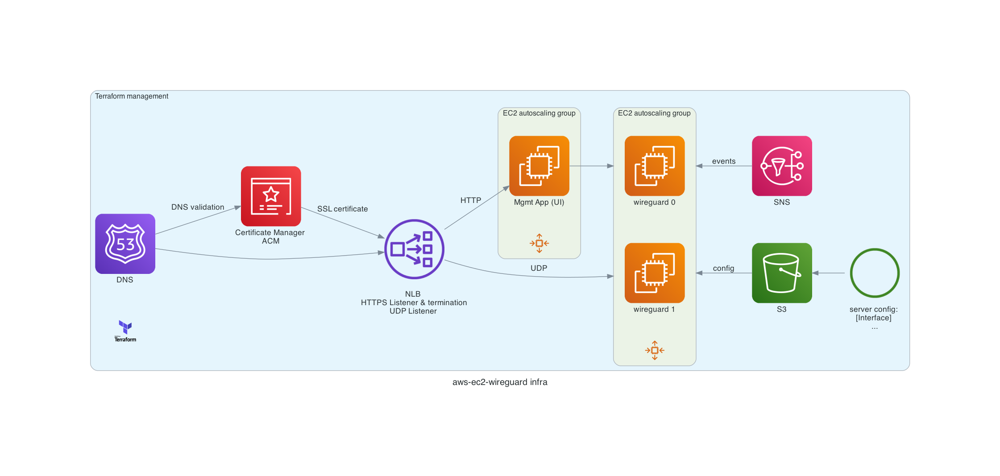
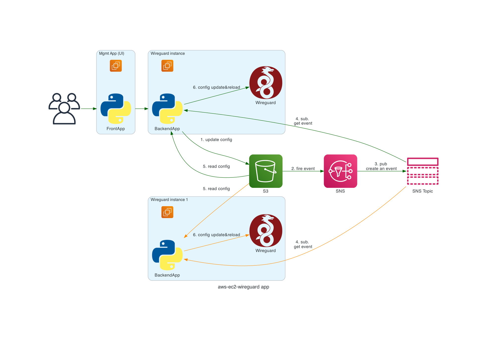

# Architecture of the module

Schemas described with the help of [Diagrams](https://diagrams.mingrammer.com/) python library

The code of the schema is in the `arcitecture.py` file of the project

## Infrastructure

Terraform create and manage all the required infrastructure for the solution.

## Application

Application divided into two parts (both can run on the same server or different servers).

FrontApp provides user control and information UI

Backend control Wireguard configuration and update it based on events from SNS

Wireguard configuration stored in S3 storage

